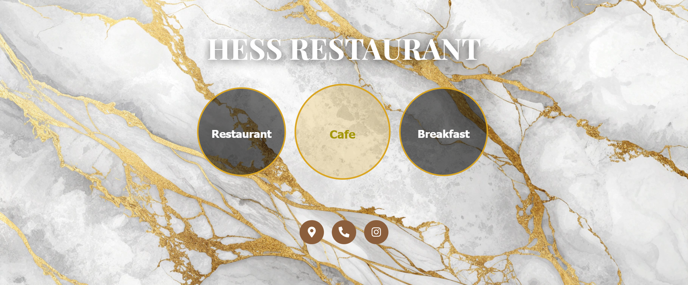

# Restaurant QR Menu (HESS)

A responsive **digital restaurant menu** for **HESS**, designed to be opened by scanning a QR code on tables.  
Built with **React + TypeScript + Vite**, fully responsive (mobile → desktop), with clean UI and RTL/LTR support.

## Features
- **Responsive UI** (mobile, tablet, desktop)
- Circular **category buttons** (Restaurant / Café / Breakfast)
- **RTL/LTR friendly** (Persian & English)
- Social actions (Instagram / Phone / Location)
- Fast dev with **Vite**, **React Router**, **TypeScript**


## Screenshots





## Tech Stack
- **React 18**, **TypeScript**
- **Vite**
- **React Router**
- **CSS** (media queries)
- **React Icons**

## Getting Started

### 1) Clone & Install
```bash
git clone https://github.com/baharat30/restaurant-QR-menu.git
cd restaurant-QR-menu
npm install
